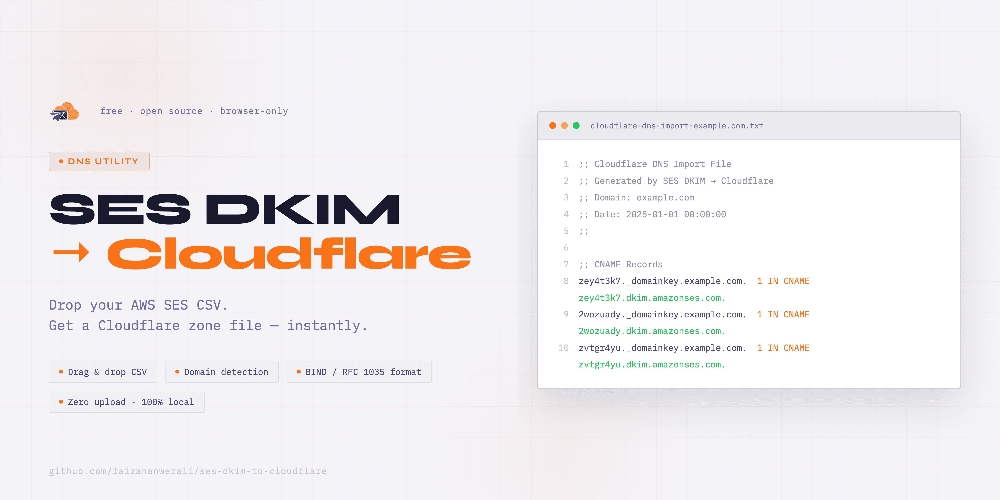

# SES DKIM → Cloudflare

A single-file browser tool that converts an AWS SES identity CSV into a Cloudflare-importable DNS zone file.

No install. No build. No dependencies. Use it live at **https://ses-dkim-to-cloudflare.pages.dev** or download the repo and open `index.html` directly in any browser.

**Live:** https://ses-dkim-to-cloudflare.pages.dev/
**Docs:** https://ses-dkim-to-cloudflare.pages.dev/docs/



## Why

AWS SES gives you a CSV when you verify a domain. Cloudflare's DNS import expects a BIND zone file. This tool bridges that gap — drag, drop, download.

## Usage

1. In AWS Console: **SES → Configuration → Identities → your domain → Authentication tab → Publish DNS records → Download .csv record set**
2. Open **https://ses-dkim-to-cloudflare.pages.dev** — or download this repo and open `index.html` in any browser if you prefer to run it locally
3. Drop the CSV onto the page
4. Download the generated `.txt` zone file
5. In Cloudflare: **DNS → Import DNS Records → upload the `.txt` file**

## Expected CSV Format

The CSV must have these three columns (case-insensitive):

```
Type,Name,Value
CNAME,abc123._domainkey.example.com,abc123.dkim.amazonses.com
```

This matches exactly what SES exports. While built for SES DKIM, it works with any CSV in this format — supported record types are `CNAME`, `TXT`, `A`, `AAAA`, and `MX`.

A sample CSV is available at [`sample/dkim-dns-records.csv`](sample/dkim-dns-records.csv) if you want to test without touching AWS.

If the CSV is missing required columns, has unrecognised record types, or contains empty fields, the tool will show an inline error with the specific row and reason. Valid rows are still processed even if some fail.

## What it does to the records

- Appends a trailing dot to names and CNAME values to make them valid FQDNs
- Wraps TXT values in quotes if not already quoted
- Groups records by type in the output
- Sets TTL to `1` (Cloudflare's automatic TTL)

## Other things the UI does

- Theme toggle — system, light, and dark mode, saved to `localStorage`
- Detects your domain from the CSV and shows it as a banner
- Downloaded filename includes the domain (e.g. `cloudflare-dns-import-example.com.txt`)
- Dropzone updates after a file is loaded so you know something actually happened
- Clear button to reset everything without refreshing

## Everything runs in your browser

No data leaves your machine. The file is read and processed entirely client-side.
