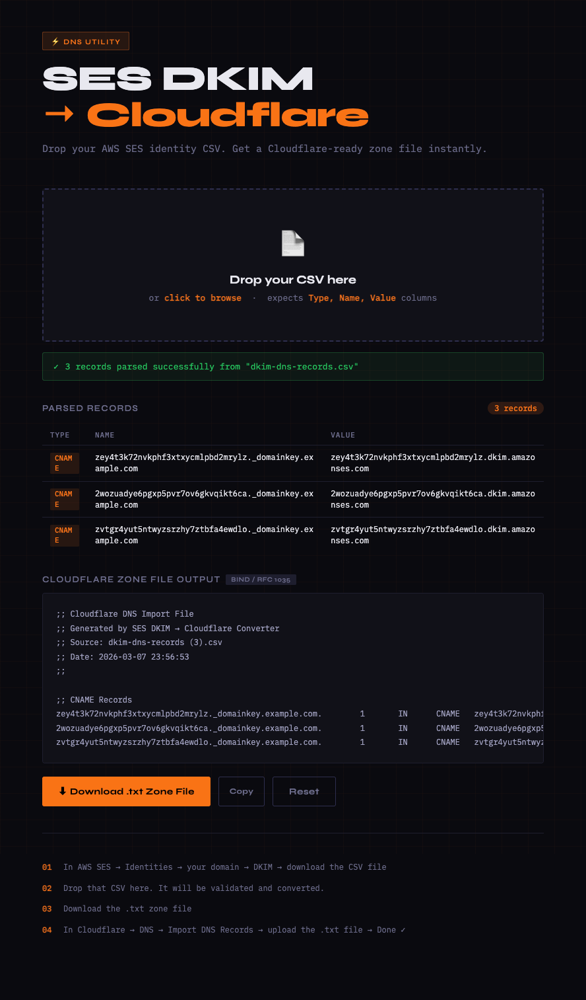

# SES DKIM → Cloudflare

A single-file browser tool that converts an AWS SES identity CSV into a Cloudflare-importable DNS zone file.

No install. No build. No dependencies. Open the HTML file in a browser and you're done.

**Live:** https://ses-dkim-to-cloudflare.pages.dev/



## Why

AWS SES gives you a CSV when you verify a domain. Cloudflare's DNS import expects a BIND zone file. This tool bridges that gap — drag, drop, download.

## Usage

1. In AWS Console: **SES → Identities → your domain → DKIM → download CSV**
2. Open `ses-dkim-to-cloudflare.html` in any browser
3. Drop the CSV onto the page
4. Download the generated `.txt` zone file
5. In Cloudflare: **DNS → Import DNS Records → upload the `.txt` file**

## Expected CSV Format

The CSV must have these three columns (case-insensitive):

```
Type,Name,Value
CNAME,abc123._domainkey.example.com,abc123.dkim.amazonses.com
```

This matches exactly what SES exports. Supported record types: `CNAME`, `TXT`, `A`, `AAAA`, `MX`.

## What it does to the records

- Appends a trailing dot to names and CNAME values to make them valid FQDNs
- Wraps TXT values in quotes if not already quoted
- Groups records by type in the output
- Sets TTL to `1` (Cloudflare's automatic TTL)

## Everything runs in your browser

No data leaves your machine. The file is read and processed entirely client-side.
